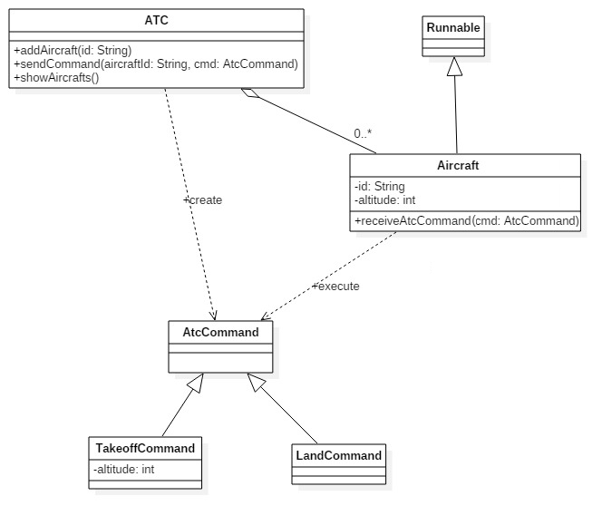

# Air Traffic Control System

In this lab you will implement a simplified air traffic control (ATC) sistem which allow user to add airplains and controll them.

## Use Case Diagram

## Aircraft State Machine Diagram

## ATC Class Diagram

## Requirements

- [x] R0 - When added aircraft is in On Stand state. In this state airplain is waiting for a comand from ATC;
- [x] R1 - When aircraft receives takeoff command will go into Taxing state and will stay there for 10 seconds;
- [x] R2 - From Taxing aircraft will go into Taking off state and will stay there for 5 seconds;
- [x] R3 - Take off command contains cruising altitude for the aircraft;
- [x] R4 - Aircraft will stay in Ascending state till aircraft reach cruising altitude. Altitude is given by ATC in 1.000 meters increments and needs 10 seconds for each increment. Example: altitude 3 = means aircraft cruising altitude is 3.000 meters and will need 30 seconds to reach that altitude;
- [x] R5 - Aircraft can receive land command only when is at cruising altitude;
- [x] R6 - Descending will be done in 1.000 meters increments;
- [x] R7 - When aircraft has reached altitude 0 is considered landed;
- [x] R8 - Aircraft will keep track of number of seconds spent in "Cruising" state and will display it after it landed;
- [ ] [OPTIONAL] - Add a graphical user interface to let user interact wit ATC system;

## Implementation recommendations

- [x] User interaction is done trough a console based user interface (Example: user will enter command TAKEOFF {aircraftid} {altitude} or LAND {aircrfatid});
- [x] Aircraft objects are implemented as threads;
- [x] After aircraft land the thread will be finished;
- [x] Use wait()\notify() mechanism to implement mechanism for aircraft to wait for ATC command;
